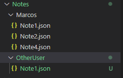
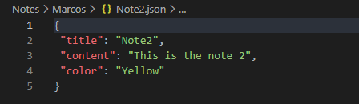

# Práctica 9 - Aplicación de procesamiento de notas de texto

## Introducción.
El objetivo de esta práctica será crear una aplicacion haciendo uso de la **API síncrona proporcionada por Node.js para trabajar con el sistema de ficheros.** y el uso de módulos de _Yargs_ y _Chalk_.

## Funcionamiento de la aplicación
Para ejecutar el programa se hace uso del comando de ejecucion `node` de manera que para poder usar la aplicación se ejecutará de la siguiente forma:
> node dist/index.js [command] [...options]

El resultado de la órden será la ejecución de uno de los comandos soportados por la aplicación:

``` bash
[~/DSI/p9(main)]$node dist/index.js add --user="Marcos" --title="Note2" --content="This is the note 2" --color="Yellow"
````
El cual creará un directorio para cada usuario y la nota con el titulo, el contenido y el color especificado:



## Índex.ts
Éste fichero contiene la creación de un objeto de tipo `NoteOperations` el cual se explicará más adelante.
```ts
const Note = new NoteOperations;
```  
Se trata de un objeto que hará de manejador de las principales operaciones de manipulación y gestión de notas.
```ts
Note.AddNote();
Note.ModifyNote();
Note.DeleteNote();
Note.ListUserNotes()
Note.ReadNote();
```
## NoteClass.ts
Éste fichero se encarga de reperesentar en un objeto una nota creada por el usuario.

```ts
  constructor(private user: string, private title: string, private content: string, private color: string,  ){}
```
Construido a base de los datos basicos para la creación de una nota: _Usuario_, _Título_, _Contenido_ y _Color_.

Tambíen tiene una serie de _Getters_ para la manipulación de los datos del objeto
```ts  
getUser(){
  return this.user;
}
getTitle(){
  return this.title;
}
getContent() {
  return this.content;
}
  ...
  ```
## NoteOperations.ts
Dicho fichero contiene todas las implementaciones de las posibles operaciones para la gestión y manipulación de notas. A través de estas funciones que hacen dichas operaciones se hace uso del módulo `Yargs` para el manejo de comandos.

### AddNote().
Éste método se encargará de la creación de Notas para un usuario en específico.
````ts
yargs.command({
      command: 'add',
      describe: 'Allows to create a new note',
      builder: {
        user: {
          describe: 'User Name',
          demandOption: true,
          type: 'string'
        },
        title: {
          describe: 'Note title',
          demandOption: true,
          type: 'string',
        },
        content: {
          describe: 'Note content',
          demandOption: true,
          type: 'string',
        },
        color: {
          describe: 'Note color',
          demandOption: true,
          type: 'string'
        }
      },
````

Lo primero es recoger los datos dado a través de la terminal para crear la estructura de una nota, en este caso se ve como se pide datos para _Usuario_, _Título_, _Contenido_ y _Color_ que trandrán que ser de tipo `string`.  
Éstos datos se quedarán almacenado en un dato _argv_
````ts
handler(argv) {
  if (typeof argv.user === 'string' && typeof argv.title === 'string' && typeof argv.content === 'string' && typeof argv.color === 'string') {
    let userNote = new BasicNote(argv.user, argv.title, argv.content, argv.color);

    ...
  }
}
````
Lo primero es comprobar si los datos introducidos cumplen con los tipo de valores necesarios en caso afirmativo se creará un objeto de tipo `BasicNote`.
````ts
if(!fs.existsSync(`./Notes/${argv.user}`)) {
  fs.mkdir(`./Notes/${argv.user}`,(err) => {
    if(err){
      console.error(chalk.redBright("An error have been ocurred. Try again..."));
      return 0;
    }
  });
}
````

Lo siguiente será comprobar la existencia del directorio personal del usuario, en caso de que no exista mediante la API de manejo de ficheros `fs.mkdir` se creará el directorio personal.

````ts
if(!fs.existsSync(`./Notes/${argv.user}/${argv.title}`)) {
  const JSONcontent = {
    title: argv.title.toString(),
    content: argv.content.toString(),
    color: argv.color.toString()
  }
````

Luego se comprueba la existencia de la nota que ha introducido el usuario mediante su título. En caso de no existir se procede a la creación de ésta creando un `JSON` con la infromación introducida por el usuario.
````ts
fs.writeFile(`./Notes/${argv.user}/${argv.title}.json`, JSONdata, (err) => {
  if(err) {
    console.error(chalk.redBright("An error have been ocurred. Try again..."));
    return 0;
  } else {
    console.log(chalk.greenBright(`New note from ${argv.user} added!!`));
    return 1;
  }
});
````
Se procede a crear dicha Nota que se trata de un archivo `JSON` con todos los datos introducidos por el usuario.


### ModifyNote()
Éste método tiene la funcionalidad de modificar una nota creada.
````ts
yargs.command({
  command: 'modify',
  describe: 'Modify a created note',
  builder: {
    user: {
      describe: 'Note owner',
      demandOption: true,
      type: 'string',
    },
    title: {
      describe: 'Note title',
      demandOption: true,
      type: 'string',
    },
    content: {
      describe: 'Note content',
      demandOption: true,
      type: 'string',
    },
    color: {
      describe: 'Note color',
      demandOption: true,
      type: 'string'
    }
  },
````
Primero se solicita los datos necesarios para la modificación de una notra especifica.
````ts
if(fs.existsSync(`./Notes/${argv.user}/${argv.title}.json`)) {
  const JSONcontent = {
    title: argv.title.toString(),
    content: argv.content.toString(),
    color: argv.color.toString()
  }
````
Luego se comprueba si existe la nota con el título especificado, en cuyo caso se crea una variable `JSON` que almacena la nueva información.

````ts
const JSONdata = JSON.stringify(JSONcontent,null,1);
fs.writeFile(`./Notes/${argv.user}/${argv.title}.json`, JSONdata, (err) => {
  if(err) {
    console.error(chalk.redBright("Something went wrong, try again"));
    return 0;
  } else {
    console.log(chalk.greenBright(`Note ${argv.title} was modified`));
    return 1;
  }
});
````
La cual se escribirá en el fichero reemplazando la antigua.

### DeleteNote()

Éste método se encargará de buscar una nota mediante su título de un usuario y eliminarla del directorio personal

````ts 
yargs.command({
  command: 'delete',
  describe: 'Delete a specific Note',
  builder: {
    user: {
      describe: 'User Name',
      demandOption: true,
      type: 'string'
    },
    title: {
      describe: 'Note title',
      demandOption: true,
      type: 'string',
    },
  },
`````
Para ello se solicita los datos necesarios.
````ts 
if(typeof argv.user === 'string' && typeof argv.title === 'string') {...}
````
Se comprueba los tipos de datos de los parametros pasados por consola.

````ts 
fs.rm(`./Notes/${argv.user}/${argv.title}.json`, { recursive: true },(err) => {
  if(err) {
    console.error(chalk.redBright("Something went wrong, try again"));
    return 0;
  } else {
    console.log(chalk.greenBright(`Note ${argv.title} was delete`))
    return 1;
  }
});
````
Mediante la función de `fs` para borrar `fs.rm` se puede borrar un archivo en concreto.

### ListUserNotes()
La funcionalidad de éste método será listar todas las notas de un determinado usuario.
````ts 
yargs.command({
  command: 'list',
  describe: 'List every notes of a specific user',
  builder: {
    user: {
      describe: 'User Name',
      demandOption: true,
      type: 'string'
    }
  },
````
Se obtienen todos los datos necesarios, en este caso solo hará falta el nombre del usuario creador de la nota.
````ts 
  if(fs.readdirSync(`./Notes/${argv.user}`)) { ... }
````
Se comprueba la existencia de un directorio personal no vacío.
````ts 
fs.readdirSync(`./Notes/${argv.user}`).forEach((userNote) => {
  const NoteContent = fs.readFileSync(`./Notes/${argv.user}/${userNote}`);
  const JSONdata = JSON.parse(String(NoteContent));
  const ListedNote = new BasicNote(JSONdata.user, JSONdata.title, JSONdata.content, JSONdata.color);
  //console.log(chalk.keyword(`${JSONdata.color}`)("prueba")) <-- TODO:
  console.log(chalk.keyword(`orange`)(`${JSONdata.title}`));
  return 1;
});
````
Se obtienen todas las posibles notas creadas por un usuario mediante la función `fs.readdirSync` que devuelve un `Array de string`, debido a esto se recorre cada posición del Array que contiene un fichero JSON y se procesa los datos para tenerlos guardados en una variable local de tipo `string` para poder manejarlos.
Una vez hecho esto solo se tendra que mostrar el título de cada Nota.  
**Problema:** la práctica solicita que se listen con los colores del usuario, esto ha sido un problema y se ha dejado un color fijo para poder sacar la aplicacion:
**ERROR:** 
````bash
/home/usuario/DSI/p9/node_modules/yargs/build/index.cjs:1
"use strict";var t=require("assert");class e extends Error{constructor(t){super(t||"yargs error"),this.name="YError",Error.captureStackTrace(this,e)}}let s,i=[];function n(t,o,a,h){s=h;let l={};if(Object.prototype.hasOwnProperty.call(t,"extends")){if("string"!=typeof t.extends)return l;const r=/\.json|\..*rc$/.test(t.extends);let h=null;if(r)h=function(t,e){return s.path.resolve(t,e)}(o,t.extends);else try{h=require.resolve(t.extends)}catch(e){return t}!function(t){if(i.indexOf(t)>-1)throw
````

### ReadNote()

La funcionalidad de éste método será leer el contenido de una nota especifica.
````ts
yargs.command({
  command: 'read',
  describe: 'Read a note of a specific user',
  builder: {
    user: {
      describe: 'User Name',
      demandOption: true,
      type: 'string'
    },
    title: {
      describe: 'Note title',
      demandOption: true,
      type: 'string'
    }
  },
````
Obtenemos los datos necesarios.
````ts
if(fs.existsSync(`./Notes/${argv.user}/${argv.title}.json`)) {
  const NoteContent = fs.readFileSync(`./Notes/${argv.user}/${argv.title}.json`);
  const JSONdata = JSON.parse(NoteContent.toString());
  const usernote = new BasicNote(JSONdata.user, JSONdata.title, JSONdata.content, JSONdata.color)
  ...
}
````
En caso de que la nota exista y sea la de interés se volcará la información en una variable con todos los datos en un tipo `string`.

````ts
  //console.log(chalk[`${JSONdata.color}`](JSONdata.title)); <-- TODO:>
  //console.log(chalk.keyword(usernote.getColor())(usernote.getContent())) <-- TODO:>
  console.log(chalk.bold.yellow(`${usernote.getTitle()}`))
  console.log(chalk.grey(`${usernote.getContent()}`))
  return console.log(chalk.greenBright("Note has been readed"));
````

Se mostrará por pantalla el contenido de dicha nota.
**Problema:** la práctica solicita que se muestre el contenido de las notas con los colores del usuario, esto ha sido un problema y se ha DEJADO un color fijo para poder sacar la aplicacion:
**ERROR:** 
````bash
/home/usuario/DSI/p9/node_modules/yargs/build/index.cjs:1
"use strict";var t=require("assert");class e extends Error{constructor(t){super(t||"yargs error"),this.name="YError",Error.captureStackTrace(this,e)}}let s,i=[];function n(t,o,a,h){s=h;let l={};if(Object.prototype.hasOwnProperty.call(t,"extends")){if("string"!=typeof t.extends)return l;const r=/\.json|\..*rc$/.test(t.extends);let h=null;if(r)h=function(t,e){return s.path.resolve(t,e)}(o,t.extends);else try{h=require.resolve(t.extends)}catch(e){return t}!function(t){if(i.indexOf(t)>-1)throw