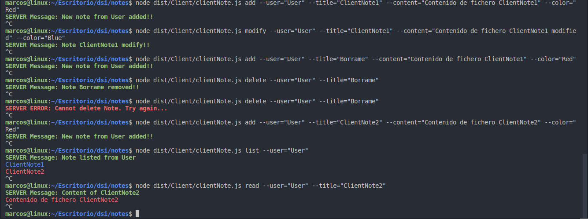

# Práctica 11. Cliente y servidor para una aplicación de procesamiento de notas de texto.


## **Cliente**
Primero se ha creado un tipo de dato personalizado para anotar los _Requests_ del cliente
```ts
export type RequestType = {
  command: 'add' | 'modify' | 'delete' | 'list' | 'read' | undefined,
  user: string,
  title?: string,
  content?: string,
  color?: string
}
```

### **Conexión con el servidor**
Gracias al uso del módulo `net` se hace una conexión con el servidor mediante un objeto `Socket` al que se le ha especificado el puerto de conexión.
```ts
const CLIENT = net.connect({port: 60300});
```
A continuación se recoge la información de los posibles comandos soportados mediante el método `command` de `yargs`. Éstos comandos soportados por la aplicación son:
* **Add**. Para crear una nota.
* **Modify**. Para modificar una nota.
* **Delete**. Para borrar una nota.
* **List**. Para listar todas las notas de un usuario.
* **Read**. Para leer el contenido de una nota de un usuario.
A continuación se hace uso de la propiedad `handler` para poder procesar los datos pasados como opciones del comando por consola. A partir de estos se crea el cuerpo de la _request_ hacia el servidor 
```ts
clientRequest = {
  command: 'add',
  user: argv.user,
  title: argv.title,
  content: argv.content,
  color: argv.color
}
```
Lo siguiente será mandar dicha request hacia el servidor recogiendo la request del cliente y serializando la información en un `JSON` mediante su método `stringfy` y manejando posibles errores.

```ts 
CLIENT.write(JSON.stringify(clientRequest),(err) => {
  if (err) {
    console.error(chalk.red(`Cannot send the Note Request to Server. Try it again...`));
  }
});
```
Cuando el servidor recoge la petición del cliente y procesa toda la información devuelve un `Response` que es captado por `listener` anotado como `data` este recoge la respuesta del servidor y procesa la información de la manera adecuada.
```ts
CLIENT.on('data', (serverResponse) => {
  const JSON_SERVER_RESPONSE = JSON.parse(String(serverResponse));
  
  if(JSON_SERVER_RESPONSE.flag === true) {
    console.log(chalk.bold.greenBright(`SERVER Message: ${JSON_SERVER_RESPONSE.serverMessage}`))
  } else {
  console.log(chalk.bold.red(`SERVER ERROR: ${JSON_SERVER_RESPONSE.serverMessage}`))
  }
  {...}
```

## **Servidor**
El servidor se enccargará de recoger la petición del cliente y de hacer persitente las notas de cada usuario y su contenido.

Se crea un tipo de dato propio para las `Responses` del servidor .
```ts
type ResponseType = {
  command: string
  flag: boolean
  serverMessage?: string
  noteArray?: string[]
}
```

Y se creará la conexión mediante un objeto `Server` que devuelve un `Socket` ambos objetos de clases Heredadas de `EventEmitter`.
```ts
net.createServer((connection) => {...}
```

Se crea un evento que tiene un escucha hacia el cliente que va a estar esperando por cualquier petición desde el cliente y creará el esqueleto de la response.
```ts
connection.on('data', (clientRequest) => {
const JSON_CLIENT_REQUEST = JSON.parse(String(clientRequest));
let response: ResponseType = {
  command: "",
  flag: false,
  serverMessage: ""
}
```

Aunque el código soporta todos los comandos requeridos se hará un ejemplo con el comando `add`.  
Lo siguiente será comprobar el comando que el cliente ha instroducido mediante un `swtich` que llamará a un método encargado de, a partir de la información proporcionada por la request del cliente procesar todos los datos y gestionar la nota, una vez se haya gestionado toda la información en las notas de interés se crea la response del servidor que será enviado al cliente.
```ts
switch (JSON_CLIENT_REQUEST.command) {
  case 'add': {
    if (AddNote(JSON_CLIENT_REQUEST)) {
      response.command = 'add'
      response.flag = true;
      response.serverMessage = `New note from ${JSON_CLIENT_REQUEST.user} added!!`;
    } else {
      response.command = 'add'
      response.flag = false;
      response.serverMessage = `Cannot create Note. Try again...`;
    }
  } 
    break;
```

Aunque eñ código soporta todos los comandos requeridos se hará un ejemplo con el comando `add`.

Cuando se consigue crear la response completa se envía hacia el cliente dicha respuesta que como se ha explicado anteriormente ésta procesará la respuesta y la comunicará por consola al usuario.

```ts
connection.write(JSON.stringify(response),(err) => {
  if(err) {
    console.error(chalk.redBright.bold("SERVER: Cannot send response"))
  } else {
    console.log(chalk.bold.greenBright("SERVER: Response sent to client."))
  }
});
```

Se maneja posibles errores y tiene un escucha para cuando un cliente cierra la comunicación.

```ts
  connection.on('error', (err) => {
    if (err) {
      console.error(chalk.redBright.bold('Connection failed. Try again...'));
    }
  });
/**
 * @event close Report the end of the connection between server and a client
 */
  connection.on('close', () => {
    console.log(chalk.green.bold(`Client disconnected.`));
  });
```

## **Funciones gestoras de Notas**
Se hace uso de una serie de funciones de apoyos para el servidor que se encargan de gestionar y hacer persitentes los datos propiciados por el cliente.

```ts
export function AddNote(JSONFile: any): boolean {
if(!fs.existsSync(`./Notes/${JSONFile.user}`)) {
  fs.mkdir(`./Notes/${JSONFile.user}`,(err) => {
    if(err){
      console.error(chalk.redBright("An error have been ocurred. Try again..."));
      return false;
    }
  });
}
if(!fs.existsSync(`./Notes/${JSONFile.user}/${JSONFile.title}`)) {
  const JSONcontent = {
    title: JSONFile.title.toString(),
    content: JSONFile.content.toString(),
    color: JSONFile.color.toString()
  }
  const JSONdata = JSON.stringify(JSONcontent,null,1)
  fs.writeFile(`./Notes/${JSONFile.user}/${JSONFile.title}.json`, JSONdata, (err) => {
    if(err) {
      console.error(chalk.redBright("An error have been ocurred. Try again..."));
      return false;
    } else {
      console.log(chalk.greenBright(`New note from ${JSONFile.user} added!!`));
      return true;
    }
  });
}
```
## **Probando los comandos**




## INCOMPLETO NO TIENE TESTS!!!!
Debido a la hora de entrega de la práctica y la "complejidad" que ha supuesto a nivel personal el desarollo de tests asíncronos se han eliminado los pocos tests que daban todos error, PERO LA PRÁCTICA ES FUNCIONAL.   
Disculpe las molestias.