# Informe Práctica 7: Modelo de datos de un sistema de información que permite almacenar una biblioteca musical

## Desarrollo de Sistemas Informáticos
Para el desarrollo de esta práctica se ha contado con 6 clases y un **index.ts**, que será nuestro fichero principal. Además se ha dividido nuestro código fuente en varios fichceros, en nuestro caso se ha usado el **módulos ES**.

## Componentes del grupo L

- Marcos Jesús Santana Ramos ([alu0101033471@ull.edu.es](alu0101033471@ull.edu.es))
- Héctor Abreu Acosta ([alu0101068855@ull.edu.es](alu0101068855@ull.edu.es))
- Marcos Padilla Herrera ([alu0101045177@ull.edu.es](alu0101045177@ull.edu.es))
- Andrea Calero Caro ([alu0101202952@ull.edu.es](alu0101202952@ull.edu.es))
- Grupo L


## ÍNDICE

1. Herramientas para el Desarrollo de la Práctica.
2. Explicación y funcionamiento.
3. Clases

    3.1. Clase Géneros Musicales

    3.2. Clase Canción

    3.3. Clase Artistas

    3.4. Clase Grupos

    3.5. Clase Álbum

    3.6. Clase Playlist

    3.7. Fichero index.ts

    3.8. Fichero Inquirer

    3.9. Fichero Inquirer-filtrado

    3.10. Fichero Inquirer-Playlist

    3.11. Fichero basedatos.ts

4. Test
5. Referencias


## Herramientas para el Desarrollo de la Práctica.
Se ha hecho uso de una series de herramientas para complementar el desarrollo de la práctica para llevar a cabo una práctica más sólida y profesional.  
* **[Typedoc](https://typedoc.org/).**
TypeDoc es un generador de documentación mediante los propios comentarios del código.
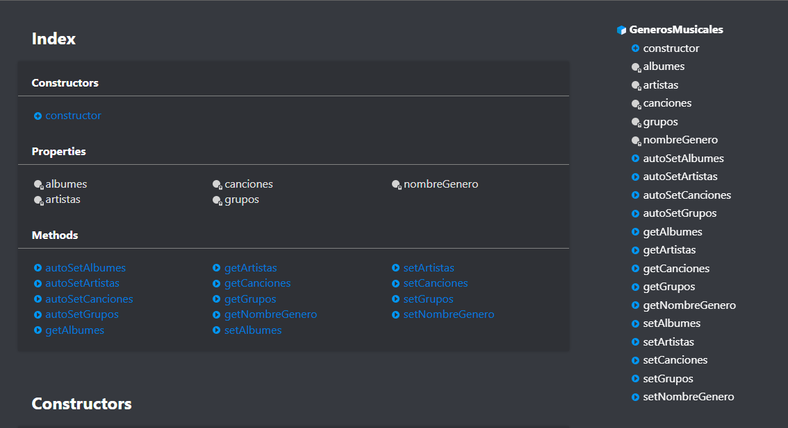  

* **[Mocha](https://mochajs.org/)**
Framework para las pruebas creadas para el código.  
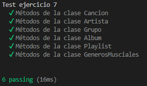
* **[Chai](https://www.chaijs.com/)**
Biblioteca de aserciones BDD / TDD para el nodo y el navegador que se puede combinar con cualquier marco de prueba de JavaScript.  
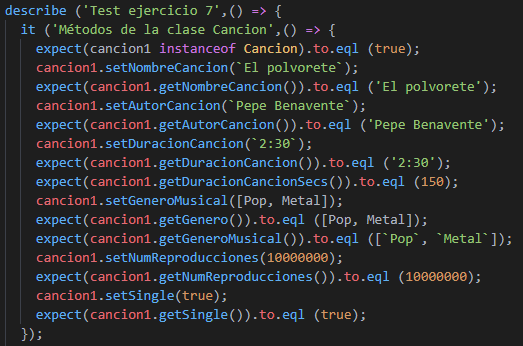
* **[Instanbul](https://istanbul.js.org/)**
Herramienta para el encubrimiento del código implementado.  
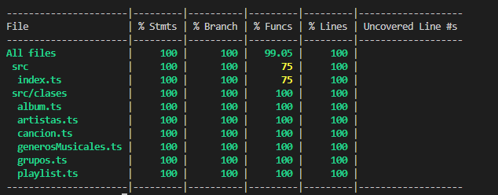  
* **[CoverAlls](https://coveralls.io/)**
Herramienta de análisis de encubrimiento del código.
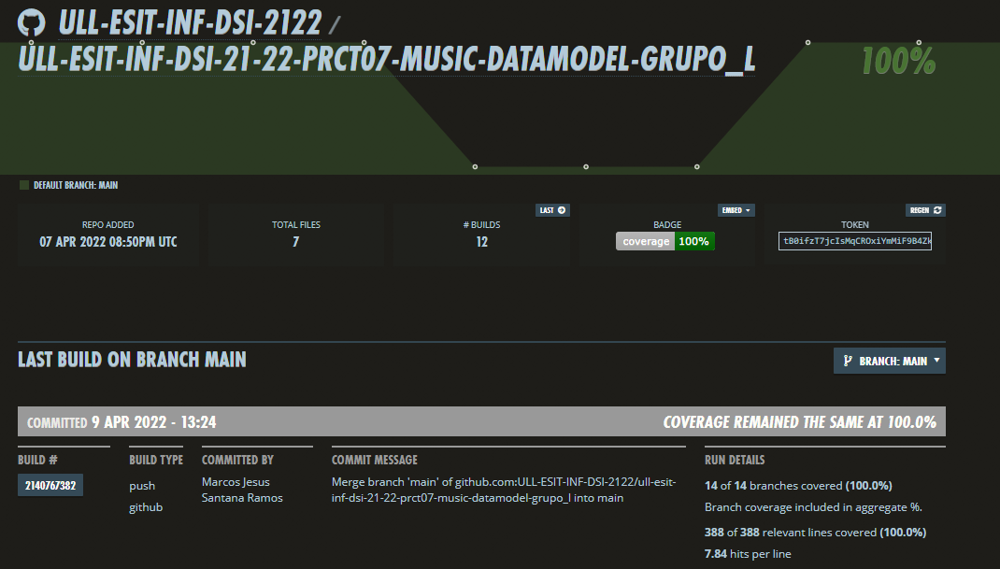
* **[GitHub Actions](https://github.com/ULL-ESIT-INF-DSI-2122/ull-esit-inf-dsi-21-22-prct07-music-datamodel-grupo_l/actions)**
Servicio de GitHub para automatizar la ejecución de un flujo de trabajo mediante los commits que se hagan. Se hace uso de ``SonarCloud Workflow``, ``CoverAlls Workflow`` entre otros.  
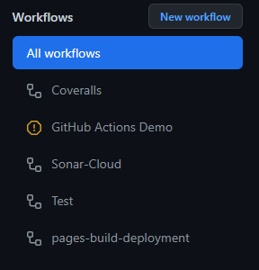


## Explicación y funcionamiento. 
En **index.ts** se crean los objetos de las clases, es decir, es el que contiene los **import** de todas las clases.

Para la creación de las clases se van a ir actualizando en función se vayan creando objetos. Por ejemplo: una vez añadida una canción, se añade la canción al genero musical que la incluye.

Se ha utilizado el módulo [Inquirer.js](https://www.npmjs.com/package/inquirer) para realizar una gestión de manera interactiva de nuestra aplicación. De este modo, añadiremos, eliminaremos y modificaremos géneros, **canciones**, **álbumes**, **grupos** y **artistas**. 

Para ejecutar el código principal del programa que tiene los distintos menús se ejecuta el comando:

> `npm run start`

### Jerarquía de Directorios y Ficheros
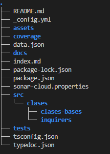  
**_NOTA:_** el contenido de `src/` es un directorio `clases/` que contiene los directorios de código fuente `clases-bases/` la cual incluye las implimentaciones de cada clase base para el desarrollo de la práctica (Canción, Artista, Album ...) y `inquirers/` con todas las implementaciones de los ficheros fuente con el uso de _inquirer.js_.

El primer menú o **Menu Principal** contiene las funcionalidades siguientes:

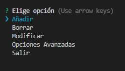

Una vez accedemos al menú **Añadir**, podemos observar las opciones:  

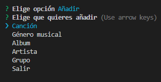

De manera similar, el menú **Borrar** consta de los mismos apartados que el **Añadir**:

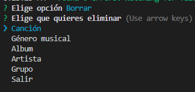

Como cabría esperar, el menú **Modificar** consta de los mismos valores a modificar que los anteriores casos:

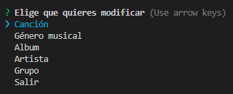


## Clases
Cada clase está situada en el directorio **src/clases/**:

- [x] Géneros Musicales
- [x] Canción
- [x] Artistas
- [x] Grupos 
- [x] Álbum 
- [x] Playlist

#### Clase Géneros Musicales

La clase ```GenerosMusicales()``` recibe en primera instancia el nombre del **género musical** para posteriormente autocompletarse mediante la creación de las otros objetos. 

Su **constructor** consta de:
- **nombreGenero** de tipo *string* que recibe el *nombre* del género en cuestión.

En cuanto se vayan creando los objetos de las siguientes clases, se añadirán al objeto **Género Musical** lo siguiente:
- **grupos** array de objetos de la clase ```Grupos()```.
- **artistas** array de objetos de la clase ```Artistas()```.
- **albumes** array de objetos de la clase ```Album()```.
- **canciones** array de objetos de la clase ```Cancion()```.

Por último, contiene los **getter** y **setter** de cada elemento para acceder y/o modificar a los elementos del objeto cuando se cree de esta clase. 

### Clase Canción

La clase ```Cancion()``` será nuestra **clase principal**, ya que es la que menos dependencia con respecto a las otras clases tiene. Su **constructor** consta de:
- **nombre** de tipo *string* cuyo contenido será el nombre de la canción.
- **autor** de tipo *string* que contiene el nombre del autor de la canción.
- **duración** de tipo *string* que contiene la duración de la canción en formato *minutos:segundos*.
- **género** de tipo *array de GenerosMusicales* que contienen los géneros musicales de la canción.
- **single** de tipo *boolean* que recibe un **true** en caso afirmativo y un **false** en caso contrario, es decir si la canción pertenece a un álbum o no.
- **numReproducciones** de tipo *number* que recibe el total de las reproducciones de la canción. En nuestro caso, se han recogido los datos mediante las visualizaciones de las canciones de los canales oficiales de **YouTube**.

En el **constructor**, se realiza el siguiente bucle **forEach**:

```typescript 
constructor(private nombre: string, private autor: string, private duracion: string, 
    private genero: GenerosMusicales[], private single: boolean, private numReproducciones: number){
      genero.forEach(element => {
        element.setCanciones(this);
      });
}
```
Este bucle se realiza para añadir la **canción** a los **géneros musicales**.

En cuanto a los métodos, destacar que se encuentra el ```getDuracionSecs()```, que devuelve el total de **segundos** que dura la canción, para que luego, en la clase ```Playlist()```, en el método ```getDuracion()``` pasar el total de los segundos de varias canciones a un formato de **horas minutos y segundos**.

Por último contiene los **getter** y **setter** de cada elemento para acceder y/o modificar a los elementos del objeto cuando se cree de esta clase.
En el caso de ```getGeneroMusical()```, lo realizamos de la siguiente manera:

```typescript
getGeneroMusical(){
  let generos: string[] = [];
  this.genero.forEach(element => {
      generos.push(element.getNombreGenero());
  });
  return generos;
}
```
Para este **getter**, se crea un *array* de *strings* vacío y se le añaden los nombres únicamente del género, no el objeto entero. Por otro lado, para el **setter** de ```setGeneroMusical()``` tenemos:

```typescript
setGeneroMusical(genero: GenerosMusicales[]){
  this.genero = [];
  this.genero = genero;
}
```
Primero se vacía el **array** y se le añade nuevamente los objetos del tipo **GeneroMusical**.

### Clase Artistas

Al igual que la clase ```GenerosMusicales()```, la clase ```Artistas()``` tiene un **constructor** y un método **construirArtista()**.

El **constructor** consta de:
- **nombreArtista** de tipo *string* que recibe el **nombre** del artista únicamente. Esto se hace para que se puedan crear objetos **artista** solo con el **nombre**, ya que hay **grupos** cuyos componentes son **artistas**, de los cuales solo se quiere conocer el **nombre**, como el caso de los guitarristas, bajistas, etc.

Después de construir el objeto, se agregarán los siguientes elementos mediente el método **construirArtista()**:
- **canciones** array de objetos de la clase ```Cancion()```.
- **oyentes** number con los *oyentes mensuales* del **artista**, que es la suma de los oyentes mensuales de los grupos en lo que ha participado y su propio trabajo individual.

El método ```construirArtista()``` se ha creado con el fin de diferenciar entre los **cantantes** de un **grupo** y los demás miembros de este. Para ello  ```construirArtista()``` se usa para crear a los cantantes o artistas **principales**:

```typescript 
construirArtista( canciones: Cancion[], oyentes: number){
		this.canciones = canciones;
		this.setOyentes(oyentes);
		let auxGeneroCanciones: GenerosMusicales[];

		this.canciones.forEach(element => {
			auxGeneroCanciones = element.getGenero();
			auxGeneroCanciones.forEach(elemento => {
				let contador: number = 0;
				for(let i = 0; i < this.generos.length; i++){
					if (elemento === this.generos[i]){
						contador++;
					}
				}
				if (contador === 0){
					this.generos.push(elemento);					
					contador = 0;
				}	
				contador = 0;
			});
		});
		this.generos.forEach(element => {
			element.setArtistas(this);
		});
	}
```
 Primeramente se añaden las **canciones** y los **oyentes mensuales** del **artista**. Luego, se puede observar que se le añaden al objeto de **generos musicales** los **artistas** que se vayan creando y evitando también que se repitan los valores del array.

```typescript 
getGrupos(){
  let grupos_: string[] = [];
  this.grupos.forEach(element => {
    grupos_.push(element.getNombreGrupo());
  });
  return grupos_;
}
```
Para los primeros casos, se crea un *array* de *strings* vacío, que devuelve el nombre de los **grupos** o **generos** o **albumes**.

```typescript 
setGrupos(grupo: Grupos[]){
		this.grupos = []
		this.grupos = grupo;
	}
```
Como en casos anteriores, primero se borra el contenido del *array* de la **clase** y luego se le añaden los nuevos objetos.

```typescript 
setOyentes(oyentes: number){
  let oyentesgrupales: number = 0;
  for(let i: number = 0; i < this.getGrupoSize(); i++){
    oyentesgrupales = oyentesgrupales + this.grupos[i].getOyentes();
  }
  this.oyentes = oyentes + oyentesgrupales;
}
```
En este caso hace la suma de los **oyentes** mencionada anteriormente.

### Clase Grupos

La clase ```Grupos()``` recibe en primera instancia el nombre del **grupo** y luego se autocompleta mediante la creación de los otros objetos. Está compuesto de:

- **nombreGrupo** string con el nombre del grupo.
- **artistas** array de artistas que componen el grupo (principales y músicos).
- **yearGrupo** number con el año en el que se fundó el grupo.
- **generoMusical** array de generos musicales.
- **albumes** array de albumes.
- **oyentes** oyentes mensuales que tiene el grupo.

El siguiente **método** añade el resto de los componentes de un **grupo**. 

```typescript 
construirGrupo(artistas: Artistas[], yearGrupo: number, genero: GenerosMusicales[], albumes: Album[], oyentes: number){
		this.artistas = artistas;
		this.yearGrupo = yearGrupo;
		this.genero = genero;
		this.albumes = albumes;
		this.oyentes = oyentes;
		genero.forEach(element => {
			element.autoSetGrupos(this);
		});
		artistas.forEach(element => {
			element.autoSetGrupos(this);
		});
		
	}
```
**Nota:**
También hay que mencionar que ```autoSetGrupos()``` añade **grupos** a los objetos **género musical** y **artista**. Dicho método se encuentra en las clases nombradas. 

```typescript 
// Caso autoSetGrupos() de la clase artistas y géneros musicales
autoSetGrupos(grupo: Grupos){
	this.grupos.push(grupo);
}
```
Tanto ```getArtistas()``` y ```getGenero()``` son muy parecidos, ambos devuelven array de strings con los nombres de los artistas que pertenecen al grupo y el género musical del genero respectivamente.

```typescript 
getArtistas(){
	let artistas_: string[] = [];
		this.artistas.forEach(element => {
			artistas_.push(element.getNombreArtista());
		});
	return artistas_;
}
```

Al igual que el ```setGrupos()```, ```setGeneros()``` y ```setAlbumes()``` de la clase **artista**, se han realizado de manera similar para esta clase. Se crea un *array* de *strings* vacío, que devuelve el nombre de los **grupos** o **generos** o **albumes**.

```typescript
setAlbumes(album: Album[]){
	this.albumes = [];
	this.albumes = album;
}
```
El resto de **setters** y **getters** son relativamente sencillos, por lo que no se han tenido en cuenta a la hora de nombrarlos, pero se han realizado y analizado.

### Clase Álbum

La ```clase Album()``` contiene:
- **nombreAlbum** string con el nombre del álbum.
- **autores** que pueden ser o de la clase **Grupos** o de la clase **Artistas**.
- **genero** arrray de **GenerosMusicales**
- **yearPublicacion** number que contiene el año en el que se publicó el álbum.
- **canciones** array de la clase **Cancion**.

Al igual que la clase anterior, el **constructor** añade a los objetos de **Género Musical**, el album, al igual que añade los artistas en caso de que sea un **artista** lo que que reciba el parámetro de **autor**.

```typescript
constructor(nombreAlbum: string, autores: Grupos | Artistas, genero: GenerosMusicales[],
		yearPublicacion: number, canciones: Cancion[]){
			this.nombreAlbum = nombreAlbum;
			this.autores = autores;
			this.genero = genero;
			this.yearPublicacion = yearPublicacion;
			this.canciones = canciones;
			if(autores instanceof Artistas){
				autores.autoSetAlbumes(this);
			}
			genero.forEach(element => {
				element.autoSetAlbumes(this);
			});
		}
```

Para leer los autores que tiene el álbum, se usa el getter:

```typescript
getAutores(){
	if (this.autores instanceof Grupos){
		return this.autores.getNombreGrupo();
	} else {
		return this.autores.getNombreArtista();
	}
}
```

Devuelve los **grupos** en caso de que el **álbum** esté hecho por un grupo, o un **artista** en caso contrario. En el caso del setter, se realiza la misma comprobación antes de añadirlo.

```typescript
setAutores(autor: Grupos | Artistas){
	if (autor instanceof Grupos){
		this.autores = autor;
	} else {
		this.autores = autor;
	}
}
```

Primero se comprueba y luego se añade a su correspondiente lugar. También se cuenta con los ```setCanciones()``` y ```getGenero()``` de clases anteriores, entre otras, pero como es el mismo código, se ha optado por omitirlo para no ser redundantes. El resto de **setters** y **getters** son relativamente sencillos, por lo que no se han tenido en cuenta a la hora de nombrarlos, pero se han realizado y analizado.

### Clase Playlist
El contenido de la ```clase Playlist()``` es el siguiente:

- **nombrePlaylist** string con el nombre de la playlist.
- **canciones** array de la clase **Canciones**.
- **duracion** string formateado de manera que devuelva las *horas, minutos y segundos* de duración de la playlist.
- **generos** array de **Generos Musicales** que conforman la playlist.

Su constructor recibe 2 párametros únicamente, sin embargo a su vez se encarga de recorrer todas las canciones y sumar los segundos totales de duración de cada canción de la playlist. Una vez conseguidos el total de segundos de la playlist, se formatean para devolver un string con las *horas minutos y segundos* totales de duración.:

```typescript
constructor(nombrePlaylist: string, canciones: Cancion[]){
		this.nombrePlaylist = nombrePlaylist;
		this.canciones = canciones;
		//this.duracion = ``;
		let auxGeneroCanciones: GenerosMusicales[];
		this.canciones.forEach(element => {
			
			auxGeneroCanciones = element.getGenero();
			auxGeneroCanciones.forEach(elemento => {
				let contador: number = 0;
				for(let i = 0; i < this.generos.length; i++){
					if (elemento === this.generos[i]){
						contador++;
					}
				}
				if (contador === 0){
					this.generos.push(elemento);					
					contador = 0;
				}	
				contador = 0;
			});
		});
		let aux: number = 0;
		this.canciones.forEach(element => {
			aux = aux + element.getDuracionCancionSecs()
		});
		let hour = Math.floor(aux / 3600);
		let min = Math.floor(aux / 60);
		let secs = aux - min * 60;
		aux = aux - hour * 3600;
		let result: string = `${hour}h ${min}min ${secs}secs`;
		this.duracion = result;
	}
```


**NOTA:**
En caso de que solo queramos obtener las *horas y minutos*, se modificaría el string devuelto, eliminando los **segundos**. El resto de **setters** y **getters**, son idénticos a los nombrados en el resto de clases, por lo que no se nombran en esta clase, pero están implementados.


### Fichero index.ts

En este fichero que se aloja al mismo nivel que el directorio __/clases__ se alojan los datos de los 10 géneros musicales, entre los cuales se reparten equitativamente las 50 canciones, los 41 artistas, ya que no solo son los cantantes independientes sino también los componentes de grupos, de los cuales se tienen 6 grupos. Además se tienen 15 álbumes y 7 playlists.

Finalmente se tendrá todos estos objetos guardados en arrays determinados para ellos (__generos[], canciones[], artistas[], grupos[], albumes[] y playlists[]__). Esto será necesario posteriormente para su añadido a la base de datos.


### Fichero Inquirer

El contenido del fichero __inquirer.ts__ tendrá el manejo de los menús y submenús que trabaja utilizando el módulo [Inquirer.js](https://www.npmjs.com/package/inquirer). Dichos menús permiten una visión más amigable para los usuarios por la terminal.

De primeras se exporta la base de datos denotada por __db__ que se crea como objeto de la clase __BaseDatos__ y se construye mediante los arrays(nombrados en el apartado anterior de  _Fichero index.ts_) que se alojan en el fichero __index.ts__ que tiene todas las canciones, albumes, artistas, grupos, etc. 

```typescript
// Crear base de datos
export let db =  new BaseDatos(index.generos, index.canciones, index.albumes, index.artistas, index.grupos, index.playlists);
```

A continuación, se tienen varios tipos de enum que serán los distintos tipos de comandos a los que llamarán los menús, son las opciones disponibles por el usuario. Siendo estos tales que:

```typescript
/**
 * @enum Commands con los comandos de añadir, borrar, modificar y salir
 */
export enum Commands {
    Add = `Añadir`,
    Borrar = `Borrar`,
    Modificar = `Modificar`,
    OpcionesAvanzadas = `Opciones Avanzadas`,
    Salir = `Salir`
}
  
/**
 * @enum CommandsClases con la clase que se quiere añadir, borrar o modificar
 */
export enum CommandsClases {
    Cancion = `Canción`,
    GeneroMusical = `Género musical`,
    Album = `Album`,
    Artista = `Artista`,
    Grupo = `Grupo`,
    Salir = `Salir`
}

/**
 * @enum CommandsSingle si es un sí o no
 */
export enum CommandsSingle {
  Si = `Si`,
  No = `No`
}

/**
 * @enum CommandsGenerosCnciones con los géneros de las canciones
 */
export enum CommandsGenerosCanciones {
  Rock = `Rock`,
  Pop = `Pop`,
  Rap = `Rap`,
  Electronica = `Electronica`,
  Regueton = `Regueton`,
  Hip_Hop = `Hip_Hop`,
  Metal = `Metal`,
  Flamenco = `Flamenco`,
  RyB = `RyB`,
  Soul = `Soul`,
  Salir = `Salir`
}

/**
 * @enum CommandsPartesCancion partes de la clase Canción
 */
export enum CommandsPartesCancion {
  Nombre = `Nombre`,
  Autor = `Autor`,
  GeneroMusical = `Género musical`,
  Duracion = `Duracion`,
  Single = `Single`,
  Reproducciones = `Número de reproducciones`,
  Salir = `Salir al menú principal`
}

/**
 * @enum CommandsGrupoArtista si es un grupo o un artista
 */
export enum CommandsGrupoArtista {
  Grupo = `Grupo`,
  Artista = `Artista`,
  Salir = `Salir`
}
/**
 * @enum CommandsGestionAvanzada de las opciones de visualizacion
 * de la información de los grupos o artistas
 */
export enum CommandsGestionAvanzada {
  AlfTitCancionAsc = `Canción alfabeticamente por título (Ascendente)`,
  AlfTitCancionDesc = `Canción alfabeticamente por título  (Descendente)`,
  AlfNombAlbumAsc = `Álbum alfabeticamente por nombre  (Ascendente)`,
  AlfNombAlbumDesc = `Álbum alfabeticamente por nombre  (Descendente)`,
  AlfNombPlaylistAsc = `Playlist ordenada por nombre alfabeticamente (Ascendente)`,
  AlfNombPlaylistDesc = `Playlist ordenada por nombre alfabeticamentet (Descendente)`,
  AnioLanzAlbumAsc = `Año de Lanzamiento de Álbum (Ascendente)`,
  AnioLanzAlbumDesc = `Año de Lanzamiento de Álbum (Descendente)`,
  NumRepTotalAsc = `Número de reproducciones totales (Ascendente)`,
  NumRepTotalDesc = `Número de reproducciones totales (Descendente)`,
  MostrarSingles = `Mostrar Singles lanzados`,
  Salir = `Salir al menú principal`
}
```

Y por otro lado del fichero se encuentra los distintos menús. El primer menú o **Menu Principal** contiene las funcionalidades siguientes:

Se ejecuta el comando para mostrar el menú principal del programa:

> `npm run start`


Como se comprueba hay distintas opciones:

- [x] Añadir -> Permite añadir canciones, géneros musicales, álbum, artista, grupo o salir(Volver Atrás).
- [x] Borrar -> Permite borrar canciones, géneros musicales, álbum, artista, grupo o salir(Volver Atrás).
- [x] Modificar -> Permite modificar canciones, géneros musicales, álbum, artista, grupo o salir(Volver Atrás).
- [x] Opciones Avanzadas -> Permite la gestión avanzada de grupos y artistas, por ello primero se pide especificar entre grupo o artista, y así navegar la información asociada a estás entidades. Por lo tanto, dentro del sistema se podrá visualizar los álbumes, canciones y playlists asociados a un grupo y/o artista que se haya indicado el nombre y el cual exista. Luego comprobar la información por orden alfabético por título de canción, nombre de playlist, año de lanzamiento de álbum, etc. Y todo ello con posibilidad de ir atrás con la opción __Salir__.
- [x] Visualizar Playlist -> Es la que permite gestionar playlist. Con la opción __Previsualizar las playlist__ muestra las playlist que contiene el sistema. Luego, con la opción __Navegar una playlist__  permite tras introducir el nombre de la playlist ver información ordenada alfabéticamente por título de la canción, por duración de la canción, etc. Y todo ello con posibilidad de ir atrás con la opción __Salir__. A continuación, la opción __Crear una playlist__ permite crear una playlist desde cero (opción __Crear una playlist nueva__) o propia a partir de una existente en el sistema (opción __Crear una playlist a partir de una existente__). Y todo ello con posibilidad de ir atrás con la opción __Salir__. Finalmente la opción __Borrar Playlist__ permite al usuario borrar una playlist, pero solo si esta ha sido creada por él, es decir, no se podrá borrar una playlist pre-cargada en el sistema. Este borrado se explica con un array copia del array original del sistema, este array copia se indica sólo para el usuario, es al que este podrá acceder para borrar y se verá más explicado en el apartado _Fichero basedatos.ts_ de este informe. 
- [x] Salir -> Finaliza el prompt de Inquirer.

Una vez accedemos al menú **Añadir**, podemos observar las opciones:  


De manera similar, el menú **Borrar** consta de los mismos apartados que el **Añadir**:


Como cabría esperar, el menú **Modificar** consta de los mismos valores a modificar que los anteriores casos:


El código de dichos menús es:

```typescript
// Menús
/**
 * @function menuAdd menu para añadir cancion, género, álbum, artista o grupo
 */
export async function menuAdd(){
    const respuestaAdd = await inquirer.prompt({
      type: 'list',
      name: `command`, 
      message: `Elige que quieres añadir`,
      choices: Object.values(CommandsClases)
    })
    switch(respuestaAdd["command"]) {
      case CommandsClases.Cancion:
        await addCancion();
        break;
      case CommandsClases.GeneroMusical:
        await inGenero.addGenero();
        break;
      case CommandsClases.Album:
        await addAlbum();
        break;
      case CommandsClases.Artista:
        addArtista();
        break;
      case CommandsClases.Grupo:
        //addGrupo();
        inGrupos.addGrupo();
        //console.log(`añadiendo una grupo`);
        break;
      case CommandsClases.Salir:
        await menuPrincipal();
        return 0;
    }
}

/**
 * @function menuDel menu para borrar cancion, género, álbum, artista o grupo
 */
 export async function menuDel(){
    const respuestaDel = await inquirer.prompt({
      type: 'list',
      name: `command`, 
      message: `Elige que quieres eliminar`,
      choices: Object.values(CommandsClases)
    })
    switch(respuestaDel["command"]) {
      case CommandsClases.Cancion:
        await menuDelCancion();
        break;
      case CommandsClases.GeneroMusical:
        await menuDelGenero();
        
        break;
      case CommandsClases.Album:
        await menuDelAlbum();
        break;
      case CommandsClases.Artista:
        await menuDelArtista();
        break;
      case CommandsClases.Grupo:
        menuDelGrupo();
        
        break;
      case CommandsClases.Salir:
        await menuPrincipal();
        return 0;
    } 
}

/**
 * @function menuMod menu para modificar cancion, género, álbum, artista o grupo
 */
 export async function menuMod(){
   console.clear();
    const respuestaMod = await inquirer.prompt({
      type: 'list',
      name: `command`, 
      message: `Elige que quieres modificar`,
      choices: Object.values(CommandsClases)
    })
    switch(respuestaMod["command"]) {
      case CommandsClases.Cancion:
         menuModCancion();
        break;
      case CommandsClases.GeneroMusical:
        //modGeneroMusical();
        inGenero.menuModGenero();
        break;
      case CommandsClases.Album:
         menuModAlbum();
        break;
      case CommandsClases.Artista:
         menumodArtista();
        break;
      case CommandsClases.Grupo:
        //console.log(`modificando una grupo`);
        inGrupos.menuModificarGrupo();
        break;
        case CommandsClases.Salir:
          await menuPrincipal();
          return 0;
    }
}

[...]

/**
 * @function menuOpcionesAvanzadas menu para visualizar de los grupos y artistas de distintas maneras
 */
export async function menuOpcionGrupoArtista(){
  const respuestaOpAvanzadas = await inquirer.prompt({
    type: 'list',
    name: `command`, 
    message: `Elige si quieres visualizar la información de grupos o artistas`,
    choices: Object.values(CommandsGrupoArtista)
  })
  switch(respuestaOpAvanzadas["command"]) {
    case CommandsGrupoArtista.Grupo:
      menuNombreGrupo();
      break;
    case CommandsGrupoArtista.Artista:
      menuNombreArtista();
      break;
    case CommandsGrupoArtista.Salir:
        console.clear();
        menuPrincipal();
        break;
  }
}

/**
 * @function menuPrincipal menu principal donde se manejan los submenus y los comandos
 * @returns 
 */
export async function menuPrincipal(){
    const respuesta = await inquirer.prompt({
      type: 'list',
      name: `command`, 
      message: `Elige opción`,
      choices: Object.values(Commands)
    })
    switch(respuesta["command"]) {
      case Commands.Add:
         menuAdd();
        break;
      case Commands.Borrar:
         menuDel();
        break;
      case Commands.Modificar:
         menuMod();
        break;
      case Commands.OpcionesAvanzadas:
        menuOpcionGrupoArtista();
        break;
      case Commands.Playlist:
      menuOpcionPlaylist();
      break;
      case Commands.Salir:
        return;
    }
}

menuPrincipal();
```

Y estos menús llaman a su vez a métodos de añadir, borrar y modificar específicos de las clases **Cancion**, **GenerosMusicales** **Album**, **Grupos** y **Artistas**. Estos métodos de añadir, borrar y modificar, siguiendo los principios SOLID se alojaron en un fichero aparte denotado por **inquirer-Cancion o Genero o Album o Grupo o artista** respectivamente.

Cada fichero tendrá estos métodos de añadir, modificar y borrar.

El método añadir se denotará tal que __addCancion o Genero o Album o Grupo o Artista()__, el modificar tal que __modCancion o Genero o Album o Grupo o Artista()__ y el método borrar tal que __delCancion o Genero o Album o Grupo o Artista()__.


Por otro lado está el menú que maneja el apartado de __Opciones Avanzadas__ de la terminal. 

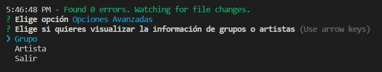


Este menú se encarga de recibir si se requiere visualizar la información de un grupo o de un artista. Y dependiendo de ello comprueba si el nombre del grupo o artista concuerda con alguno de los ya existentes, esto se comprueba mediante los dos menús denotados por __menuNombreGrupo()__ y __menuNombreArtista()__:

```typescript
/**
 * @function menuNombreGrupo compruea si existe el grupo a visualizar
 */
export async function menuNombreGrupo() {
  const nombreGrupo = await inquirer.prompt({
    type: 'input',
    name: `command`, 
    message: `Introduce el nombre del grupo que quieres visualizar la información:`
  })
  let nombre: string = nombreGrupo["command"];
  
  let numeroGrupo: number = -1;
  for(let i: number = 0; i < index.grupos.length; i++){
    if(index.grupos[i].getNombreGrupo() === nombre){
      numeroGrupo = i;
      break;
    }
  }
  if(numeroGrupo === -1){
    console.log(`No existe un grupo con ese nombre`);
    menuNombreGrupo();
  } else {
    menuOpcionesAvanzadas(index.grupos[numeroGrupo]);
  }
}

/**
 * @function menuNombreArtista comprueba si existe el artista a visualizar
 */
export async function menuNombreArtista() {
  const nombreArtista = await inquirer.prompt({
    type: 'input',
    name: `command`, 
    message: `Introduce el nombre del artista que quieres visualizar la información:`
  })
  let nombre: string = nombreArtista["command"];
  
  let numeroArtista: number = -1;
  for(let i: number = 0; i < index.artistas.length; i++){
    if(index.artistas[i].getNombreArtista() === nombre){
      numeroArtista = i;
      break;
    }
  }
  if(numeroArtista === -1){
    console.log(`No existe un artista con ese nombre`);
    menuNombreArtista();
  } else {
    menuOpcionesAvanzadas(index.artistas[numeroArtista]);
  }
}
```

Si no existe el nombre entonces se repite la llamada al actual menú, en caso contrario es que el nombre existe y se pasa al siguiente menú __menuOpcionesAvanzadas()__ este recibe por argumento el nombre del autor, lo cual puede ser un Artista o un Grupo, y entonces este menú se encarga de realizar la visualización de la información asociado con el grupo o artista. La información que muestra es:

- [x] Alfabéticamente por título de la canción, ascendente y descendente.
- [x] Alfabéticamente por nombre del álbum, ascendente y descendente.
- [x] Alfabéticamente por nombre de la playlist, ascendente y descendente.
- [x] Por año de lanzamiento del álbum, ascendente y descendente.
- [x] Por número de reproducciones totales, ascendente y descendente.
- [x] Filtrar para mostrar únicamente los singles lanzados.

Mostrándose por terminal:

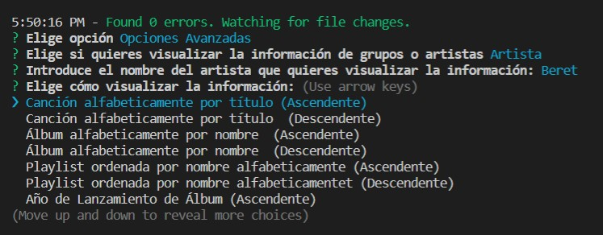


El código se muestra tal que una selección de casos entre las distintas opciones de visualización de la información, donde se le pasa el nombre del autor (Artista o Grupo) y este llama a los métodos correspondientes alojados en el fichero **inquirer-filtrado.ts** que tiene como alias **InquirerFiltrado**:

```typescript
/**
 * @function menuOpcionesAvanzadas menu para visualizar de los grupos y artistas de distintas maneras 
 * (alfabeticamente por titulo de canción, años de lanzamiento, número de reproducciones, etc)
 */
 export async function menuOpcionesAvanzadas(autor_: Artistas | Grupos) {
  const respuestaOpAvanzadas = await inquirer.prompt({
    type: 'list',
    name: `command`, 
    message: `Elige cómo visualizar la información:`,
    choices: Object.values(CommandsGestionAvanzada)
  })
  
  switch(respuestaOpAvanzadas["command"]) {
    case CommandsGestionAvanzada.AlfTitCancionAsc:
      InquirerFiltrado.AlfTitCancionAsc(autor_);
      break;
    case CommandsGestionAvanzada.AlfTitCancionDesc:
      InquirerFiltrado.AlfTitCancionDesc(autor_);
      break;
    case CommandsGestionAvanzada.AlfNombAlbumAsc:
      InquirerFiltrado.AlfNombAlbumAsc(autor_);
      break;
    case CommandsGestionAvanzada.AlfNombAlbumDesc:
      InquirerFiltrado.AlfNombAlbumDesc(autor_);
      break;
    case CommandsGestionAvanzada.AlfNombPlaylistAsc:
      InquirerFiltrado.AlfNombPlaylistAsc(autor_);
      break;
    case CommandsGestionAvanzada.AlfNombPlaylistDesc:
      InquirerFiltrado.AlfNombPlaylistDesc(autor_);
      break;
    case CommandsGestionAvanzada.AnioLanzAlbumAsc:
      InquirerFiltrado.AnioLanzAlbumAsc(autor_);
      break;
    case CommandsGestionAvanzada.AnioLanzAlbumDesc:
      InquirerFiltrado.AnioLanzAlbumDesc(autor_);
      break;
    case CommandsGestionAvanzada.NumRepTotalAsc:
      InquirerFiltrado.NumRepTotalAsc(autor_);
      break;
    case CommandsGestionAvanzada.NumRepTotalDesc:
      InquirerFiltrado.NumRepTotalDesc(autor_);
      break;
    case CommandsGestionAvanzada.MostrarSingles:
      InquirerFiltrado.MostrarSingles(autor_);
      break;
    case CommandsGestionAvanzada.Salir:
      console.clear();
      menuPrincipal();
      break;
  }
}
```

Dichas funciones se explican en el siguiente apartado de  _Fichero Inquirerfiltrado_ de este informe.


Finalmente, se encuentra el menú encargado de la gestión de las playlists que se denota por ```menuOpcionPlaylist```:

```typescript
export async function menuOpcionPlaylist(){
  //console.clear();
   const respuestaPlay = await inquirer.prompt({
     type: 'list',
     name: `command`, 
     message: `Elige opción sobre Playlist `,
     choices: Object.values(CommandsPlay)
   })
   switch(respuestaPlay["command"]) {
     case CommandsPlay.Previsualizar:
        inPlay.PrePlaylist();
       break;
     case CommandsPlay.Navegar:
     inPlay.NombrePlay();
       //inGenero.menuModGenero();
       break;
    case CommandsPlay.Crear:
    inPlay.crearPlay();
      //inGenero.menuModGenero();
      break;
      case CommandsPlay.Borrar:
    inPlay.borrarPlay();
      //inGenero.menuModGenero();
      break;
     case CommandsPlay.Salir:
       console.clear();
          menuPrincipal();
     
     break;
   }
}
```

Este menú según las opciones antes explicadas de creación, visualización de playlist, etc. Llama así al __inPlay__ que es el alias del fichero __inquirer-Playlist__ que tiene el manejo de dichas funciones y se explica en el apartado _Fichero Inquirer-Playlist_ de este informe.


### Fichero Inquirer-filtrado

El contenido del fichero __inquirer-filtrado.ts__ tiene las funciones implementadas para la visualización de la información como se indicó anteriormente.

- [x] Alfabéticamente por título de la canción, ascendente y descendente: Lo maneja las funciones __AlfTitCancionAsc()__ y __AlfTitCancionDesc()__ respectivamente.
- [x] Alfabéticamente por nombre del álbum, ascendente y descendente: Lo maneja las funciones __AlfNombAlbumAsc()__ y __AlfNombAlbumDesc()__ respectivamente.
- [x] Alfabéticamente por nombre de la playlist, ascendente y descendente: Lo maneja las funciones __AlfNombPlaylistAsc()__ y __AlfNombPlaylistDesc()__ respectivamente.
- [x] Por año de lanzamiento del álbum, ascendente y descendente: Lo maneja las funciones __AnioLanzAlbumAsc()__ y __AnioLanzAlbumDesc()__ respectivamente.
- [x] Por número de reproducciones totales, ascendente y descendente: Lo maneja las funciones __NumRepTotalAsc()__ y __NumRepTotalDesc()__ respectivamente.
- [x] Filtrar para mostrar únicamente los singles lanzados: Lo maneja la función __MostrarSingles()__


Todas ellas reciben el nombre del artista u grupo y todas luego con un guardián de tipo del estilo __if(){} else{}__ se comprueba que si es una instancia de la clase __Artistas__ o __Grupos__ entonces se realiza de manera distinta, ya que los artistas por ejemplo, sí tiene las canciones del artista pero los grupos no tienen las canciones, sino que se tiene que acceder a los álbumes y luego de ellos a las canciones de esos álbumes. Y esto sucede con muchos de estos métodos.

El planteamiento general que se empleó fue:

Con los métodos donde el ordenar las canciones, álbumes y playlist es de manera _ascendente_; es decir, los métodos __AlfTitCancionAsc()__ , __AlfNombAlbumAsc()__ y __AlfNombPlaylistAsc()__, se empleó la lógica del método de los objetos tipo __Array__ que es el método __sort()__ proporciona un orden ya predeterminado de manera ascendente. Mientras que por el lado contrario, el de ordenar las canciones, álbumes y playlist es de manera _descendente_; es decir, los métodos __AlfTitCancionDesc()__ , __AlfNombAlbumDesc()__ y __AlfNombPlaylistDesc()__ se empleó la lógica del método de los objetos tipo __Array__ que es el método __sort().reverse()__ lo cual permite que se ordene de manera descendente.

Con los métodos __AnioLanzAlbumAsc()__ y __AnioLanzAlbumDesc()__, __NumRepTotalAsc()__ y __NumRepTotalDesc()__, que ordena un valor más bien numérico se utilizó el __Algoritmo BubbleSort__ que permite la ordenación según los criterios de [BubbleSort](https://es.wikipedia.org/wiki/Ordenamiento_de_burbuja). Esto facilita que se puedan ordenar de manera ascendente y descendente los años de lanzamiento de los álbumes y el número de reproducciones totales. La diferencia entre ascendente y descendente en ambos casos es que el símbolo cambia, donde en el caso ascendente se pide que sea el anterior mayor al siguiente valor y en el caso descendente, se quiere que el caso actual sea menor que el siguiente:

__MÉTODOS ASCENDENTES__

```typescript
for(let i = 0; i < cancionesGrupo_.length; i++) {
            for(let j = 0; j < cancionesGrupo_.length - 1; j++) {
                if(cancionesGrupo_[j].getNumReproducciones() > cancionesGrupo_[j + 1].getNumReproducciones()) {
                    let swap = cancionesGrupo_[j];
                    cancionesGrupo_[j] = cancionesGrupo_[j + 1];
                    cancionesGrupo_[j + 1] = swap;
                }
            }
        }
```

__MÉTODOS DESCENDENTES__

```typescript
for(let i = 0; i < cancionesGrupo_.length; i++) {
            for(let j = 0; j < cancionesGrupo_.length - 1; j++) {
                if(cancionesGrupo_[j].getNumReproducciones() < cancionesGrupo_[j + 1].getNumReproducciones()) {
                    let swap = cancionesGrupo_[j];
                    cancionesGrupo_[j] = cancionesGrupo_[j + 1];
                    cancionesGrupo_[j + 1] = swap;
                }
            }
        }
```

Y dicha lógica se aplica a esos cuatro métodos.

Finalmente, con el método de __MostrarSingles()__ la lógica que se empleó es que mediante la variable __flag__ que es tipo boolean y se iguala a false se compruebe que luego al analizar los singles, tal que:

```typescript
flag = auxCanciones[i].getSingle();
```

Entonces si es true se sabe que es un single esa canción y por tanto se añade al array auxiliar y se muestra por pantallas todas aquellas canciones del grupo o artista que son singles.


### Fichero Inquirer-Playlist

Primero se encuentra algunos enum que tiene los comandos con las opciones con las que constaría el usuario para la visualización, creación y borrado de las playlist.

Este menú al seleccionar la opción __Visualizar Playlist__ del menú principal se muestra tal que:

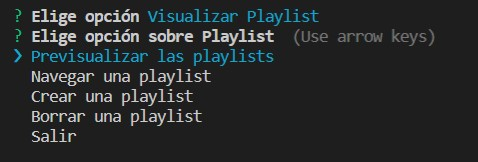

Con la opción __Previsualizar las playlists__ se previsualiza todas las playlist existentes dentro del sistema.

Mostrándose tal que:

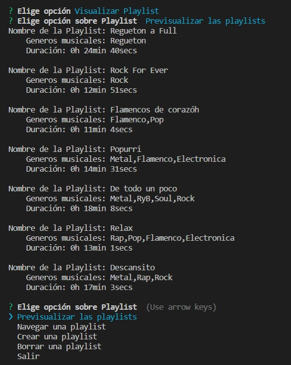

Siendo el código una muestra de las playlist tal que:

```typescript
/**
 * Funcion PrePlaylist
 */
export async function PrePlaylist() {
  //console.table(index.playlists);
  index.playlists.forEach(element =>{
    console.log(`Nombre de la Playlist: ${element.getNombrePlaylist()}
    Generos musicales: ${element.getGeneros()}
    Duración: ${element.getDuracion()} \n`);

  })
  InquirerFile.menuOpcionPlaylist();
} 
```

La otra opción de este menú es Navegar una playlist la cual permite visualizar las canciones dentro de la playlist y decidir en qué orden desea que aparezcan con su información ordenada según lo especificado. Para ello primero se requiere el nombre de la playlist, que en caso de no existir permite volver a introducir un nombre de las playlist existentes. Mostrándose tal que:

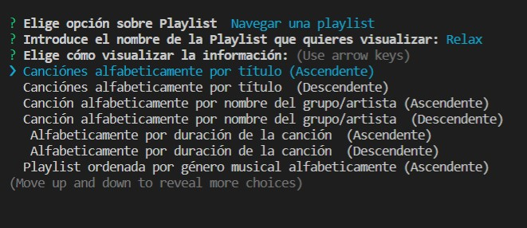


Por ejemplo al seleccionar _Canciones alfabeticamente por título ascendente_. Se muestra tal que:

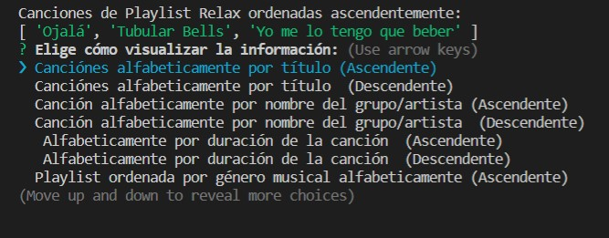

Estas funciones se implementaron con la lógica similar a la antes nombrada para la visualización de información de los grupos y artistas pero específica para playlist y con funciones specíficas. Cuyo menú de manejo de estas funciones es:

```typescript
/**
 * Menu Opciones Avanzadas de Playlist
 * @param play_ playlist object
 */
export async function menuOpcionesAvanzadasPlay(play_: Playlist) {
  const respuestaOpAvanzadas = await inquirer.prompt({
    type: 'list',
    name: `command`, 
    message: `Elige cómo visualizar la información:`,
    choices: Object.values(CommandsGestionPlay)
  })
  switch(respuestaOpAvanzadas["command"]) {
    case CommandsGestionPlay.AlfTitCancionAsc:
      AlfTitCancionAsc(play_);
      break;
    case CommandsGestionPlay.AlfTitCancionDesc:
      AlfTitCancionDesc(play_);
      break;
    case CommandsGestionPlay.AlfGoAAsc:
     AlfAutorAsc(play_);
      break;
    case CommandsGestionPlay.AlfGoADesc:
      AlfAutorDesc(play_);
      break;
    case CommandsGestionPlay.AlfduracionCanAsc:
      AlfDuracionAsc(play_);
      break;
    case CommandsGestionPlay.AlfduracionCanDesc:
      AlfDuracionDesc(play_);
      break;
    case CommandsGestionPlay.AlfgeneroAsc:
     AlfgeneroAsc(play_);
      break;
    case CommandsGestionPlay.AlfgeneroDesc:
      AlfgeneroDesc(play_);
            break;
    case CommandsGestionPlay.AnioLanzCancionAsc:
      AnioLanzAsc(play_);
      break;
    case CommandsGestionPlay.AnioLanzCancionDesc:
      AnioLanzDesc(play_);
      break;
    case CommandsGestionPlay.NumRepTotalAsc:
      NumRepTotalAsc(play_);
      break;
      case CommandsGestionPlay.NumRepTotalDesc:
        NumRepTotalDesc(play_);
      break;
    case CommandsGestionPlay.Salir:
      console.clear();
      menuPrincipal();
      break;
  }
}
```

Y dicho menú contiene la opción de salir al menú principal.

Por otro lado está la opción de __Crear una playlist__, esta como se indicó permite crear una playlist desde cero (opción __Crear una playlist nueva__) o propia a partir de una existente en el sistema (opción __Crear una playlist a partir de una existente__). Y todo ello con posibilidad de ir atrás con la opción __Salir__.

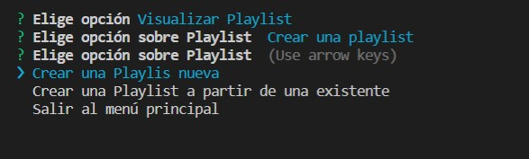

Cuyo menú se implementó tal que:

```typescript
/**
 * Funcion crearPlay
 */
export async function crearPlay() {
  const respuestacrear = await inquirer.prompt({
    type:  'list',
    name: `command`, 
    message: `Elige opción sobre Playlist `,
    choices: Object.values(CommandsCrearPlay)
  })
  switch(respuestacrear["command"]) {
    case CommandsCrearPlay.New:
       addPlay();
      break;
    case CommandsCrearPlay.Exist:
      addPlayExistente();
      //inGenero.menuModGenero();
      break;
    case CommandsCrearPlay.Salir:
      console.clear();
         menuPrincipal();
    
    break;
  }
}
```

El método __addPlay()__ es para crear una nueva desde cero y el método __addPlayExistente()__ a partir de una existente preguntando así el nombre de dicha playlist y comprobando que esta existe.

```typescript
/**
 * Funcion addPlayExistente
 */
export async function addPlayExistente(){

  const nombrePlayE = await inquirer.prompt( {
    type: "input",
    name: "nombre",
    message: "Introduce el nombre de la playlist: "
  })
  let nombre_E: string = nombrePlayE["nombre"];
  let numeroplay_: number = -1;
  for(let i: number = 0; i < index.playlists.length; i++){
    if(index.playlists[i].getNombrePlaylist() === nombre_E){
      numeroplay_ = i;
      break;
    }
  }
  if (numeroplay_ === -1){
    console.clear();
      console.log(`El nombre introducido no concuerda con ninguna Playtlist existente.`);
      await addPlayExistente();
      return 0;
    }
    else{
      
      const nombrePlay = await inquirer.prompt( {
      type: "input",
      name: "nombre",
      message: "Introduce el nuevo nombre de la playlist: "
    });
    let nombre_: string = nombrePlay["nombre"];
    let cancion: Cancion[] = index.playlists[numeroplay_].getCanciones();
    const opcionPlay = await inquirer.prompt( {
      type: "list",
      name: "nombre",
      message: "Opciones: ",
      choices: Object.values(BoA)
    });
    switch(opcionPlay["nombre"]){
      case BoA.Añadir:
        await addCancionPlay(cancion);
        break;
      case BoA.Borrar:
        await delCancionPlay(cancion);
        break;
      case BoA.Salir:
        InquirerFile.menuOpcionPlaylist();
        return 0;
    }
    let playlistNew = new Playlist(nombre_, cancion);
    InquirerFile.db.addNuevoPlay(playlistNew);
    console.clear();
  InquirerFile.menuPrincipal();
  } 
}
```
 Se introduce el nuevo nombre de la playlist y luego te permite tres opciones dentro, el añadir cancion a la playlist, borrar canción o salir al menú de la playlist.

El código para añadir canciones a la play existente que ahora cambió el nombre es:

```typescript
/**
 * Funcion addCancionPlay
 * @param cancion array de canciones
 * @returns array modificada
 */
export async function addCancionPlay(cancion: Cancion[]){
  const cancionNombre = await inquirer.prompt( {
    type: "input",
    name: "cancion",
    message: "Nombre de la canción a añadir en la playlist: "
  });
  let nombreCancion_: string = cancionNombre["cancion"];
  let numeroCancion_: number = -1;
  for(let i: number = 0; i < index.canciones.length; i++){
    if(index.canciones[i].getNombreCancion() === nombreCancion_){
      numeroCancion_ = i;
      break;
    }
  }
  if (numeroCancion_ === -1){
    console.clear();
      console.log(`El nombre introducido no concuerda con ningún Cancion existente.`);
      await addCancionPlay(cancion);
      return 0;
    }
    else {
      cancion.push(index.canciones[numeroCancion_]);
    }
    const masCancion = await inquirer.prompt( {
      type: "list",
      name: "saberCancion",
      message: "¿Quieres incluir más Canciones?: ",
      choices: Object.values(InquirerFile.CommandsSingle)
    });
    switch(masCancion["saberCancion"]) {
      case InquirerFile.CommandsSingle.Si:
        await addCancionPlay(cancion)
        break;
      case InquirerFile.CommandsSingle.No:
        break;
    }
}
```

Y el código para borrar una canción de dicha playlist es:

```typescript
/**
 * Funcion delCancionPlay
 * @param cancion array de canciones
 * @returns array modificado
 */
export async function delCancionPlay(cancion: Cancion[]){
  const cancionNombre = await inquirer.prompt( {
    type: "input",
    name: "cancion",
    message: "Nombre de la canción a borrar en la playlist: "
  });
  let nombreCancion_: string = cancionNombre["cancion"];
  let numeroCancion_: number = -1;
  for(let i: number = 0; i < index.canciones.length; i++){
    if(index.canciones[i].getNombreCancion() === nombreCancion_){
      numeroCancion_ = i;
      break;
    }
  }
  if (numeroCancion_ === -1){
    console.clear();
      console.log(`El nombre introducido no concuerda con ningún Cancion existente.`);
      await delCancionPlay(cancion);
      return 0;
    }
    else {
      cancion.splice(numeroCancion_, 1);
    }
}
```

La última opción de este menú de __Visualizar Playlist__ es la opción de __Borrar una Playlist__, esta requerirá del nombre de una playlist pero debe ser del usuario ya que del sistema le impedirá borrar. Para ello el código es:

```typescript
/**
 * Funcion borrarPlay
 */
export async function borrarPlay() {
  const nombrePlayE = await inquirer.prompt( {
    type: "input",
    name: "nombre",
    message: "Introduce el nombre de la playlist: "
  })
  let nombre_E: string = nombrePlayE["nombre"];
  let numeroplay_: number = -1;
  let lista: Playlist[] = [];
   lista = db.getPlayLista();
  for(let i: number = 0; i < index.playlists.length; i++){
    if(lista[i].getNombrePlaylist() === nombre_E){
      numeroplay_ = i;
      break;
    }
  }
  if (numeroplay_ === -1){
    console.clear();
      console.log(`El nombre introducido no concuerda con ninguna Playtlist existente.`);
      await borrarPlay();
      return 0;
    }
    else{
      let lista: Playlist[] = db.getPlayLista();
      lista.splice(numeroplay_,1);
      db.setPlayLista(lista);
      InquirerFile.menuOpcionPlaylist();
      return 0;
    }

}
```

Como se aprecia en la parte del código:

```typescript
const nombrePlayE = await inquirer.prompt( {
    type: "input",
    name: "nombre",
    message: "Introduce el nombre de la playlist: "
  })
  let nombre_E: string = nombrePlayE["nombre"];
  let numeroplay_: number = -1;
  let lista: Playlist[] = [];
   lista = db.getPlayLista();
  for(let i: number = 0; i < index.playlists.length; i++){
    if(lista[i].getNombrePlaylist() === nombre_E){
      numeroplay_ = i;
      break;
    }
  }
```

Donde se comprueba que exista la playlist es en un array copia tipo __Playlist__ que se asocia con __db.getPlayLista()__ que es un getter de listas de playlist exclusivamente del usuario y que se crea en la base de datos por ello se llama a __db__ que es el objeto base de datos de nuestra class ```BaseDatos```. 

Y así finaliza la explicación del fichero __inquirer-Playlist.ts__.


### Fichero basedatos.ts

Se ha utilizado el módulo [Lowdb](https://www.npmjs.com/package/lowdb) para realizar una gestión a la base de datos de nuestra aplicación.

Primero este fichero contiene un type __dbtype__ con los atributos y tipos de estos que se almacenarán en la base de datos y con los que esta trabajará. 

```typescript
/**
 * @type dbtype con los datos y sus tipos que se introducen en
 * la base de datos
 */
type dbtype = {
    canciones: {
        nombre: string;
        autor: string;
        duracion: string;
        genero: GenerosMusicales[];
        single: boolean;
        numReproducciones: number;
    }[],
    generosmusicales: {
        nombreGenero: string;
	    grupos: string[];
	    artistas: string[];
	    albumes: string[];
	    canciones: string[];
    }[],
    
    albumes: {
        nombreAlbum: string;
	    autores: Grupos | Artistas;
	    genero: GenerosMusicales[];
	    yearPublicacion: number;
	    canciones: Cancion[];
    }[],
    artistas: {
        nombreArtista: string;
	    grupos: string[];
        generos: GenerosMusicales[];
        albumes: string[];
        canciones: Cancion[];
        oyentes: number;
    }[],
    grupos: {
        nombreGrupo: string;
	    artistas: Artistas[];
	    yearGrupo: number;
	    genero: GenerosMusicales[];
	    albumes: Album[];
	    oyentes: number;
    }[];
    playlist: {
        nombrePlaylist: string;
	    canciones: Cancion[];
	    duracion: string;
	    generos: GenerosMusicales[];
    }[];
    playlistUsuario: {
        nombrePlaylist: string;
	    canciones: Cancion[];
	    duracion: string;
	    generos: GenerosMusicales[];
    }[];
};
```

Este fichero contiene la clase ```BaseDatos``` la cual construirá y guardará datos en la base de datos junto con sus __setters__ y __getters__ específicos.

Esta base de datos como se observa tiene dos atributos tipo __Playlist[]__ que son __playArrayLista__ y __playUsuarioArrayLista__. El usuario para crear sus nuevas playlist y borrarlas (ya que sólo puede borrar las suyas y no las del sistema) tendrá acceso solamente al atributo __playUsuarioArrayLista__, mediante el getter correspondiente.

La base de datos guardará los datos respectivos que se le pasen mediante la función ```guardarBaseDatos()``` que invoca al método __write()__ de la librería de Lowdb.

```typescript
/**
     * @method guardarBaseDatos que guarda en la base de datos los
     * géneros musicales, canciones, álbumes, artistas y grupos de la app
     */
    guardarBaseDatos() {
        this.basedatos.set("generosmusicales", [this.generosArrayLista]).write();
        this.basedatos.set("canciones", [this.cancionesArrayLista]).write();
        this.basedatos.set("albumes", [this.albumesArrayLista]).write();
        this.basedatos.set("artistas", [this.artistasArrayLista]).write();
        this.basedatos.set("grupos", [this.gruposArrayLista]).write();
        this.basedatos.set("playlist", [this.playArrayLista]).write();
        this.basedatos.set("playlistUsuario", [this.playUsuarioArrayLista]).write();
    }
```

Los demás métodos que tiene son para añadir, y borrar canciones, géneros musicales, álbumes, artistas y grupos. Estos métodos serán llamados por los ficheros **inquirer-Cancion o Genero o Album o Grupo o artista** respectivamente que se nombraron anteriormente y así esos objetos son añadidos o borrados.

En el caso de playlist y como se ha indicado sus métodos serán relativos al atributo __playUsuarioArrayLista__. Con el fin de conseguir que el usuario no borre playlist del sistema.


## Tests
A la hora de realizar test para comprobar el correcto funcionamiento de todo el proyecto, se ha decidido realizar sobre un único archivo **tester.spec.ts** localizado en **./test/**. Se ha decidido hacerlo de esta manera, porque todas las clases dependen las unas de las otras, por lo que habría que realizar **imports**, en nuestro caso, en cada uno de los archivos de testeo de cada clase.

Los tests en cuestión compueban cada clase una por una modificándolas y comprobando que sus resultados son correctos.

```typescript
import 'mocha';
import { expect } from 'chai';
import { Album } from '../src/clases/album'
import { Artistas } from "../src/clases/artistas";
import { Cancion } from "../src/clases/cancion";
import { GenerosMusicales } from "../src/clases/generosMusicales";
import { Grupos } from "../src/clases/grupos";
import { Playlist } from "../src/clases/playlist";
import {  cancion1, cancion2} from "../src/index";
import { Metal, Rock, RyB, Soul, Pop} from "../src/index";
import { artista1, grupo1} from "../src/index";
import { album1 } from "../src/index";
import { playlist1 } from "../src/index";

describe('Métodos de la Clase Cancion',() => {
  it ('Clase Artista Operativa',() => { 
    expect(cancion1 instanceof Cancion).to.eql (true);
  });
  it ('Probando metodo setNombreCancion() y getNombreCancion()',() => { 
    cancion1.setNombreCancion(`El polvorete`);
    expect(cancion1.getNombreCancion()).to.eql ('El polvorete');
  });
  it ('Probando metodo setAutorCancion() y getAutorCancion()',() => { 
    cancion1.setAutorCancion(`Pepe Benavente`);
    expect(cancion1.getAutorCancion()).to.eql ('Pepe Benavente');
  });
  it ('Probando metodo setDuracionCancion() y getDuracionCancionSecs()',() => { 
    cancion1.setDuracionCancion(`2:30`);
    expect(cancion1.getDuracionCancion()).to.eql ('2:30');
    expect(cancion1.getDuracionCancionSecs()).to.eql (150);
  });
  it ('Probando metodo setGeneroMusical() y getGeneroMusical()',() => { 
    cancion1.setGeneroMusical([Pop, Metal]);
    expect(cancion1.getGenero()).to.eql ([Pop, Metal]);
    expect(cancion1.getGeneroMusical()).to.eql ([`Pop`, `Metal`]);
  });
  it ('Probando metodo setNumReproducciones() y getNumReproducciones()',() => { 
    cancion1.setNumReproducciones(10000000);
    expect(cancion1.getNumReproducciones()).to.eql (10000000);
  });
  it ('Probando metodo setSingle() y getSingle()',() => { 
    cancion1.setSingle(true);
    expect(cancion1.getSingle()).to.eql (true);
  });
});
 
describe('Métodos de la Clase Cancion',() => {
  it ('Clase Cancion Operativa',() => { 
    expect(cancion1 instanceof Cancion).to.eql (true);
  });
  it ('Probando metodo setNombreCancion() y getNombreCancion()',() => { 
    cancion1.setNombreCancion(`El polvorete`);
    expect(cancion1.getNombreCancion()).to.eql ('El polvorete');
  });
  it ('Probando metodo setAutorCancion() y getAutorCancion()',() => { 
    cancion1.setAutorCancion(`Pepe Benavente`);
    expect(cancion1.getAutorCancion()).to.eql ('Pepe Benavente');
  });
  it ('Probando metodo setDuracionCancion() y getDuracionCancionSecs()',() => { 
    cancion1.setDuracionCancion(`2:30`);
    expect(cancion1.getDuracionCancion()).to.eql ('2:30');
    expect(cancion1.getDuracionCancionSecs()).to.eql (150);
  });
  it ('Probando metodo setGeneroMusical() y getGeneroMusical()',() => { 
    cancion1.setGeneroMusical([Pop, Metal]);
    expect(cancion1.getGenero()).to.eql ([Pop, Metal]);
    expect(cancion1.getGeneroMusical()).to.eql ([`Pop`, `Metal`]);
  });
  it ('Probando metodo setNumReproducciones() y getNumReproducciones()',() => { 
    cancion1.setNumReproducciones(10000000);
    expect(cancion1.getNumReproducciones()).to.eql (10000000);
  });
  it ('Probando metodo setSingle() y getSingle()',() => { 
    cancion1.setSingle(true);
    expect(cancion1.getSingle()).to.eql (true);
  });
});


  describe ('Métodos de la clase Artista',() => { 
    expect(artista1 instanceof Artistas).to.eql (true);
    it ('Clase Artista Operativa',() => { 
      expect(artista1 instanceof Artistas).to.eql (true);
    });
    it ('Probando metodo setNombreArtista() y getNombreArtista()',() => { 
    artista1.setNombreArtista(`Pepe Benavente`);
    expect(artista1.getNombreArtista()).to.eql ('Pepe Benavente');
    });
    it ('Probando metodo setGrupos() y getGrupos()',() => {
      artista1.setGrupos(["Pepe Benavente"]);
      expect(artista1.getGrupos()).to.eql ([`Pepe Benavente`]);
    });
    it ('Probando metodo setGrupos() y getGrupos()',() => {
      artista1.setGrupos(["Pepe Benavente"]);
      expect(artista1.getGrupos()).to.eql ([`Pepe Benavente`]);
    });
    it ('Probando metodo setCanciones() y getCanciones()',() => {
      artista1.setCanciones([cancion1,cancion2]);
      expect(artista1.getCanciones()).to.eql ([ 'El polvorete', 'Thriller' ]);
    });
    it ('Probando metodo setCanciones() y getCanciones()',() => {
      artista1.setGeneros([Pop, Metal]);
      expect(artista1.getGeneros()).to.eql ([`Pop`, `Metal`]);
    });
    it ('Probando metodo setOyentes() y getOyentes()',() => {
      artista1.setOyentes(1000000);
      expect(artista1.getOyentes()).to.eq (1000000);
    });
    it ('Probando metodo getGrupoSize()',() => {
      expect(artista1.getGrupoSize()).to.eql (1);
    });
    it ('Probando metodo setOyentes() y getOyentes()',() => {
      artista1.setAlbumes([album1]);
      expect(artista1.getAlbumes()).to.eql ([`Thriller`]);
    });
  });


  describe('Métodos de la Clase Grupo',() => {
    it ('Clase Grupo Operativa',() => { 
      expect(grupo1 instanceof Grupos).to.eql (true);
    });
    it ('Probando metodo setNombreGrupo() y getNombreGrupo()',() => { 
      grupo1.setNombreGrupo(`los 4`);
      expect(grupo1.getNombreGrupo()).to.eql ('los 4');
    });
    it ('Probando metodo setArtistas() y getArtistas_()',() => { 
      grupo1.setArtistas([artista1]);
      expect(grupo1.getArtistas_()).to.eql ([artista1]);
    });
    it ('Probando metodo setYearGrupo() y getYearGrupo()',() => { 
      grupo1.setYearGrupo(1999);
      expect(grupo1.getYearGrupo()).to.eql (1999);
    });
    it ('Probando metodo setGenero() y getGenero()',() => { 
      grupo1.setGenero([Pop, Metal]);
      expect(grupo1.getGenero()).to.eql ([`Pop`, `Metal`]);
    });
    it ('Probando metodo setAlbumes() y getAlbumes()',() => { 
      grupo1.setAlbumes([album1]);
      expect(grupo1.getAlbumes()).to.eql ([album1]);
    });
    it ('Probando metodo setOyentes() y getOyentes()',() => { 
      grupo1.setOyentes(1000);
    expect(grupo1.getOyentes()).to.eql (1000);
    });
  });

  describe('Métodos de la Clase Album',() => {
    it ('Clase Album Operativa',() => { 
      expect(album1 instanceof Album).to.eql (true);
    });
    it ('Probando metodo setNombreAlbum() y getNombreAlbum()',() => { 
      album1.setNombreAlbum(`MotoMami`);
      expect(album1.getNombreAlbum()).to.eql (`MotoMami`);
    });
    it ('Probando metodo setAutores() y getAutores()',() => { 
      album1.setAutores(grupo1.getNombreGrupo());
     expect(album1.getAutores()).to.eql (`los 4`);
     album1.setAutores(artista1);
     expect(album1.getAutores()).to.eql ('Pepe Benavente');
    });
    it ('Probando metodo setGenero() y getGenero()',() => { 
      album1.setGenero([Pop, Metal]);
     expect(album1.getGenero()).to.eql ([`Pop`, `Metal`]);
    });
    it ('Probando metodo setYear() y getYear()',() => { 
      album1.setYear(2020);
     expect(album1.getYear()).to.eql (2020);
    });
    it ('Probando metodo setCanciones() y getCanciones()',() => { 
      album1.setCanciones([cancion1,cancion2]);
      expect(album1.getCanciones()).to.eql ([cancion1,cancion2]); 
    });
  });


  describe('Métodos de la Clase Playlist',() => {
    it ('Clase Playlist Operativa',() => { 
      expect(playlist1 instanceof Playlist).to.eql (true);
    });
    it ('Probando metodo setNombrePlaylist() y getNombrePlaylist()',() => { 
      playlist1.setNombrePlaylist(`Musiquita a full`);
      expect(playlist1.getNombrePlaylist()).to.eql (`Musiquita a full`);
    });
    it ('Probando metodo setDuracion() y getDuracion()',() => { 
      playlist1.setDuracion(`10:20`);
      expect(playlist1.getDuracion()).to.eql ('0h 24min 40secs');
    });
    it ('Probando metodo setCanciones() y getCanciones()',() => { 
      playlist1.setCanciones([cancion1,cancion2]);
      expect(playlist1.getCanciones()).to.eql ([cancion1,cancion2]);
    });
    it ('Probando metodo setGeneros() y getGeneros()',() => { 
      playlist1.setGeneros([Pop, Metal]);
      expect(playlist1.getGeneros()).to.eql ([`Pop`, `Metal`]);
    });
  });


  describe('Métodos de la Clase Generos Musicales',() => {
    it ('Clase Generos Operativa',() => { 
      expect(Pop instanceof GenerosMusicales).to.eql (true);
    });
    it ('Probando metodo setNombreGenero() y getNombreGenero()',() => { 
      Pop.setNombreGenero(`Trap`);
      expect(Pop.getNombreGenero()).to.eql (`Trap`);
    });
    it ('Probando metodo setGrupos() y getGrupos()',() => { 
      Pop.setGrupos([grupo1.getNombreGrupo()]);
      expect(Pop.getGrupos()).to.eql (['los 4']);
    });
    it ('Probando metodo setArtistas() y getArtistas()',() => { 
      Pop.setArtistas([artista1.getNombreArtista()]);
      expect(Pop.getArtistas()).to.eql (['Pepe Benavente']);
    });
    it ('Probando metodo setAlbumes() y getAlbumes()',() => { 
      Pop.setAlbumes([album1.getNombreAlbum()]);
      expect(Pop.getAlbumes()).to.eql (['MotoMami']);
    });
    it ('Probando metodo setCanciones() y getCanciones()',() => { 
      Pop.setCanciones([cancion1.getNombreCancion()]);
      expect(Pop.getCanciones()).to.eql (['El polvorete']);
    });
  });
```


## Referencias 

* **[Typedoc](https://typedoc.org/).**
TypeDoc es un generador de documentación mediante los propios comentarios del código.  

* **[Mocha](https://mochajs.org/)**
Framework para las pruebas creadas para el código.  

* **[Chai](https://www.chaijs.com/)**
Biblioteca de aserciones BDD / TDD para el nodo y el navegador que se puede combinar con cualquier marco de prueba de JavaScript.  

* **[Instanbul](https://istanbul.js.org/)**
Herramienta para el encubrimiento del código implementado.

* **[CoverAlls](https://coveralls.io/)**
Herramienta de análisis de encubrimiento del código.

* **[GitHub Actions](https://github.com/ULL-ESIT-INF-DSI-2122/ull-esit-inf-dsi-21-22-prct07-music-datamodel-grupo_l/actions)**
Servicio de GitHub para automatizar la ejecución de un flujo de trabajo mediante los commits que se hagan. Se hace uso de ``SonarCloud Workflow``, ``CoverAlls Workflow`` entre otros.  

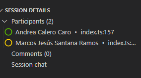
